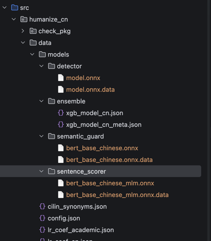

# AIGC 检测器 — 中文 AI 文本检测与降重

基于多特征融合的中文 AI 生成内容（AIGC）检测系统，支持论文逐段检测、批量改写降重。

## 核心特性

| 特性 | 说明 |
|------|------|
| **三路融合检测** | BERT（语义）+ XGBoost（统计）+ Rule（规则）自适应融合 |
| **检测准确率** | AUROC 0.968，F1 0.906（HC3 测试集 3742 条） |
| **抗攻击鲁棒性** | 同义词替换/句子打乱/插入噪声下降 < 5% |
| **Web 界面** | 上传 .docx 自动分段检测，实时进度展示 |
| **本地运行** | 无需联网，无需 API Key，保护隐私 |

## 快速开始

### 安装

```bash
# 克隆项目
git clone https://github.com/voidborne-d/humanize-chinese.git
cd humanize-chinese

# 安装依赖（推荐 uv）
uv sync

# 或 pip
pip install -e .
```

### 启动 Web 界面

```bash
PYTHONPATH=src python3 web/app.py --port 8080
```

访问 http://localhost:8080，上传 .docx 文件即可检测。

### 命令行检测

```bash
# 单文本检测
PYTHONPATH=src python3 -c "
from humanize_cn.check_pkg.api import check
r = check('这是一段测试文本')
print(f\"AI Score: {r['ai_score']}/100 ({r['ai_level']})\")
"

# 论文检测
PYTHONPATH=src python3 test_paper.py 论文.json --no-rewrite
```

## 项目结构

```
.
├── src/humanize_cn/          # 核心代码
│   ├── check_pkg/api.py      # 统一检测接口（三路融合）
│   ├── models/               # 检测模型
│   │   ├── bert_detector.py  # BERT ONNX 推理
│   │   ├── ensemble_scorer.py# XGBoost 集成
│   │   ├── ngram.py          # 37 维 n-gram 特征
│   │   ├── token_ppl.py      # Token 级困惑度
│   │   └── perturbation.py   # 扰动特征
│   └── rewrite/              # 改写模块
├── web/                      # Web 界面
│   └── app.py                # Flask 服务
├── scripts/                  # 工具脚本
│   ├── generate_ai_corpus.py # AI 语料生成
│   ├── prepare_training_data.py # 数据清洗
│   ├── train_xgb_scorer.py   # 模型训练
│   ├── eval_ensemble.py      # 综合评估
│   └── eval_adversarial.py   # 抗攻击测试
├── output/                   # 输出目录
│   ├── eval_results.json     # 评估结果
│   ├── adversarial_results.json # 抗攻击结果
│   └── xgb_model_cn.json     # 训练好的模型
└── training_data/            # 训练数据
    ├── hc3_all.jsonl         # HC3 数据集
    └── ai_generated_*.jsonl  # API 生成的 AI 文本
```

## 检测原理

### 三路融合策略

```
BERT ≥90 或 ≤10  →  直接信任 BERT（跳过 XGBoost）
BERT 10-90       →  BERT 0.7 + XGBoost 0.3 融合
```

### 特征维度

| 类型 | 维度 | 说明 |
|------|------|------|
| n-gram | 37 | 困惑度、突发性、GLTR rank、句长分布等 |
| Token PPL | 5 | 逐 token 困惑度统计 |
| Perturbation | 3 | 同义词替换敏感度 |
| BERT | 1 | 语义层面 AI 概率 |

## 评估结果

### 综合评估（HC3 测试集 3742 条）

| 指标 | 数值 |
|------|------|
| AUROC | 0.968 |
| Accuracy | 0.906 |
| F1 | 0.906 |
| Precision | 0.904 |
| Recall | 0.908 |

### 抗攻击测试（100 样本）

| 攻击类型 | 检测率 | 下降 |
|----------|--------|------|
| 基线 | 91.0% | - |
| 同义词替换 | 87.0% | -4.0% |
| 句子打乱 | 89.0% | -2.0% |
| 插入噪声 | 87.0% | -4.0% |
| 混合文本 | 68.0% | -23.0% ⚠️ |

## 使用场景

### 1. 论文 AIGC 检测

上传 .docx 文件，自动提取正文段落（跳过标题/图表/参考文献），逐段输出 AI 分数和等级。

### 2. 批量改写降重

```bash
# 生成改写版本
PYTHONPATH=src python3 -c "
from humanize_cn import humanize_academic
text = open('论文.txt').read()
result = humanize_academic(text, aggressive=False)
print(result)
"
```

### 3. 训练自己的模型

```bash
# 1. 生成 AI 语料
python scripts/generate_ai_corpus.py --api qwen --model qwen3.6-plus

# 2. 准备训练数据
python scripts/prepare_training_data.py

# 3. 训练 XGBoost
python scripts/train_xgb_scorer.py

# 4. 评估
python scripts/eval_ensemble.py --test output/test.jsonl
python scripts/eval_adversarial.py --test output/test.jsonl
```

## 技术栈

- **检测模型**: BERT (ONNX) + XGBoost + Rule-based
- **Web 框架**: Flask + SSE 流式响应
- **文档解析**: wordformat (段落结构识别)
- **日志**: loguru
- **依赖管理**: uv/pip

## 模型文件

| 文件 | 大小 | 说明 |
|------|------|------|
| `data/models/detector/model.onnx` | ~400MB | BERT 检测模型 |
| `output/xgb_model_cn.json` | ~2MB | XGBoost 集成模型 |

模型文件需单独下载（release 页面）。
将模型文件放置在 `src/humanize_cn/models/` 目录下。
示例：


## License

MIT Non-Commercial — 个人学习、学术研究、非商业开源项目可用。

禁止商业使用，包括但不限于：
- 销售本软件或衍生品
- 包装成付费 SaaS/API 服务
- 集成到商业产品
- 提供付费改写/检测服务

